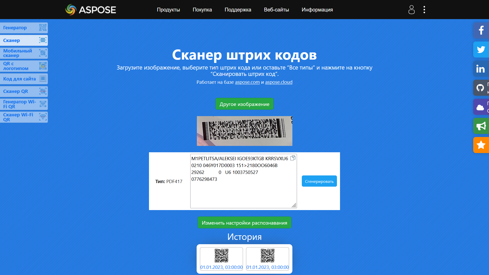
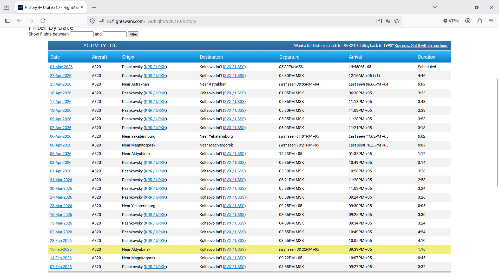
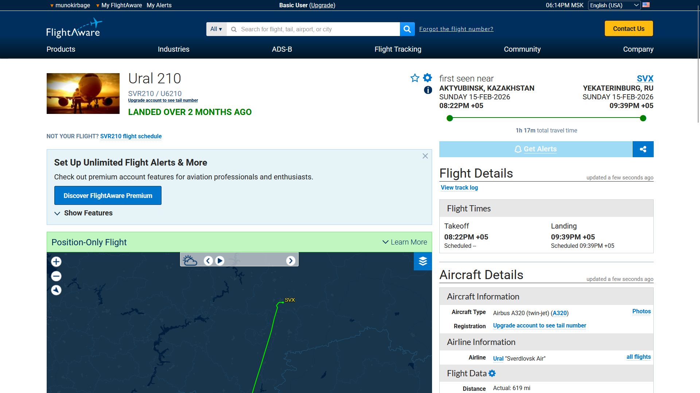

## Условие
Один мой знакомый пересмотрел фильмов про хакеров и пытается быть таким же скрытным. Давай ему объясним, что это не так. Найди номер рейса, куда он прилетел, и во сколько.

Формат флага: `KubSTU{Flight_City_Arrival:Time}`

## Решение
Для флага нам нужно получить номер рейса, город и время прибытия. Нам дана картинка с авиабилетом. На нем есть штрихкод, в котором лежит информация о билете.

Сканируем штрихкод, и извлекаем оттуда данный текст 
```M1PETLITSA/ALEKSEI IGOE93KTGB KRRSVXU6 0210 046Y017D0003 151>2180OO6046B                29262           0   U6 1003750527          077629847```
Это стандарт BCBP, согласно нему можем узнать, что рейс был из KRR (Краснодарский аэропорт) в SVX (аэропорт Екатеринбурга), номер рейса - U6 0210, а рейс был 15 февраля (46 день от начала года).
Ищем информацию об этом рейсе 15 февраля.
На сайте flightaware.com, находим наш рейс U6210 (на сайте он отображается как SVR210).

Ищем 15 февраля и находим время прибытия, нужное для флага.

Все данные для флага собраны.

**Флаг: `KubSTU{U6210_Yekaterinburg_21:39}`**